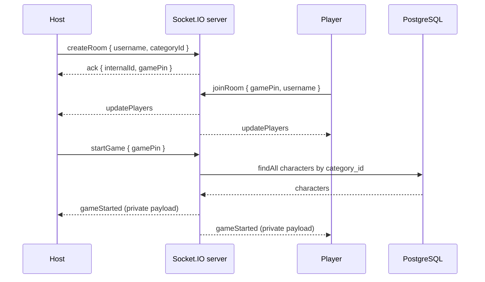

# Arquitectura Actual

Este documento describe el codigo ejecutable actual. Los diagramas Mermaid de la raiz y los tipos `User`, `Game` y `PlayerGame` representan una direccion anterior o futura, no modelos conectados al servidor.

## Limites Del Sistema

| Area | Fuente principal | Estado |
| --- | --- | --- |
| Composicion del servidor | `src/index.ts` | Un proceso comparte el mismo servidor HTTP entre Express y Socket.IO. |
| Lobby y comienzo de partida | `src/sockets/rooms.ts` | Estado en memoria por proceso. |
| Catalogo | `src/api/services/category/`, `src/api/services/character/` | CRUD Sequelize sobre PostgreSQL. |
| Administracion | `src/admin/` | AdminJS autenticado para Category y Character. |
| Configuracion de BD | `src/db/sequelize.ts` | Una instancia Sequelize, URL de entorno y SSL obligatorio. |
| Cliente de prueba | `client/index.html` | Harness legado; no representa por completo el contrato activo. |

`src/sockets/game.ts` declara sus propios mapas de salas y eventos, pero nadie importa su `registerSocketHandlers`. Modificarlo no cambia el servidor.

## Flujo De Ejecucion

1. Los imports de modelos crean la instancia Sequelize y exigen `DB_CONNECTION_STRING`.
2. `src/index.ts` crea Express, configura CORS/JSON y construye un servidor HTTP.
3. Socket.IO usa ese servidor, fuerza `websocket` y registra `rooms.ts`.
4. Express monta `/admin`, `/api/category` y `/api/character`.
5. El proceso escucha en `PORT` o `3000`. No autentica la BD ni sincroniza el esquema durante el arranque.

Morgan se monta despues de las rutas, por lo que las solicitudes resueltas por esas rutas no pasan por el logger.

## Estado Y Persistencia

PostgreSQL contiene dos modelos activos:

- `category`: UUID, nombre, descripcion y estado `active | inactive`.
- `character`: UUID, nombre, descripcion, imagen y `category_id`; pertenece a Category.

El modulo `rooms.ts` conserva dos objetos a nivel de proceso:

- `rooms[internalId]`: host, PIN, categoria, jugadores y bandera `gameStarted`.
- `pinMap[gamePin]`: traduccion del PIN publico al UUID interno.

No existe una capa de repositorio para salas ni adaptador compartido. Esto implica que un reinicio pierde todo el juego y que dos replicas del servidor no compartirian salas sin sticky sessions y un almacen externo.

## Secuencia Del Juego

Al iniciar:

- Solo se acepta el `socket.id` guardado como host.
- Se bloquea una segunda llamada mediante `gameStarted`.
- Se elige un personaje de la categoria con `Math.random()`.
- Se elige exactamente un indice de jugador como impostor.
- Cada jugador recibe un `gameStarted` privado. El personaje o cualquier identificador que permita resolverlo nunca debe emitirse a toda la sala porque eso lo revelaria al impostor.

La separacion actual es incompleta: los mismos objetos `PlayerData` almacenan datos publicos y secretos. Un `updatePlayers` posterior al inicio puede difundir `isImpostor` y `characterId`; este defecto no forma parte del contrato deseado.

## Desconexion

El handler busca la primera sala que contenga el `socket.id`, elimina al jugador y emite `updatePlayers`. Si era host, asigna al primer jugador restante como nuevo host; si no queda nadie, elimina `rooms[internalId]`.

Hay defectos conocidos en este orden y limpieza, descritos en `TECHNICAL_DEBT.md`: la emision ocurre antes de transferir el host, puede incluir datos secretos del juego, solo se limpia la primera membresia y no se elimina la entrada correspondiente de `pinMap`.

## Contratos Que Cruzan Capas

- El frontend envia `categoryId`, pero Sequelize consulta `category_id`.
- `gamePin` es un numero de seis digitos; `internalId` es el nombre UUID de la sala Socket.IO y no deberia sustituirse por el PIN sin revisar colisiones y exposicion.
- La identidad actual es la conexion (`socket.id`), no un usuario persistente. Reconectar crea otra identidad.
- AdminJS y REST comparten modelos, pero solo AdminJS esta detras del login de administrador.
